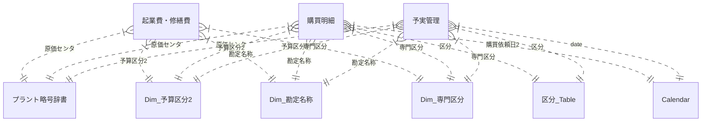

# BI設計仕様書 - maintenanceCosts

## 1. 概要
本レポートは、設備メンテナンスコストの予実管理を行うためのPower BIプロジェクトです。
予算と実績を可視化し、進捗状況や着地予想を確認することができます。

## 2. データソース
- **PowerPlatform Dataflows**: 主要なトランザクションデータ（予実管理、購買明細など）はDataflowから取得しています。

## 3. データモデル

### 3.1. テーブル一覧
主要なテーブルは以下の通りです。

| テーブル名 | 種類 | 説明 |
| --- | --- | --- |
| **予実管理** | ファクト | 予算と実績を管理するメインのファクトテーブル |
| **購買明細** | ファクト | 購買発注の詳細データ |
| **起業費・修繕費** | ファクト | 起業費および修繕費の詳細データ |
| **Calendar** | ディメンション | 日付マスタ（年度、月などの情報を含む） |
| **プラント略号辞書** | ディメンション | 原価センタとプラントの対応 |
| **Dim_予算区分2** | ディメンション | 予算区分の定義 |
| **Dim_勘定名称** | ディメンション | 勘定科目の定義 |
| **Dim_専門区分** | ディメンション | 専門区分の定義 |
| **DAX_全体** | メジャー | プロジェクト全体で使用する計算メジャーを格納 |

### 3.2. リレーションシップ図
主要なファクトテーブルとディメンションテーブルの関係を以下に示します。

## 4. 主要テーブル詳細

### 4.1. 予実管理
予算と実績を統合したテーブルです。
- **データソース**: PowerPlatform Dataflows (`8c7302d1-372e-44f6-8bcc-ce8e510317d7`)
- **主要カラム**:
    - `予算年度`: データの対象年度
    - `原価センタ`: 所属部署を表すコード
    - `計画予算金額`: 計画時の予算額
    - `実績金額`: 発生した実績額
    - `予算区分１`, `予算区分２`: 予算の種類を分類するコード

### 4.2. 購買明細
個別の購買発注データを管理します。
- **主要カラム**:
    - `購買発注ＮＯ`: 発注単位の識別子
    - `品名`: 購入品目の名称
    - `実績明細金額`: 明細ごとの実績金額
    - `購買依頼日`, `購買発注日`: 日付情報

## 5. 主要メジャー (DAX)
`DAX_全体` テーブルに定義されている主要な計算式です。

- **実績累積**
    - 現在までの実績金額の累積（年度累計）を計算します。
    - `TOTALYTD([実績],'Calendar'[Date],"3/31")`

- **予算累積**
    - 月割予算の累積値を計算します。
    - `[計画予算月割]*MAX('Calendar'[4月始まり])+0`

- **着地予想**
    - 線形回帰 (`LINESTX`) を用いて、現在の実績推移から年度末の着地見込みを予測します。

- **調整予算**
    - 単位（円、千円、百万円、億円）に応じて予算額を表示形式に合わせて変換します。
